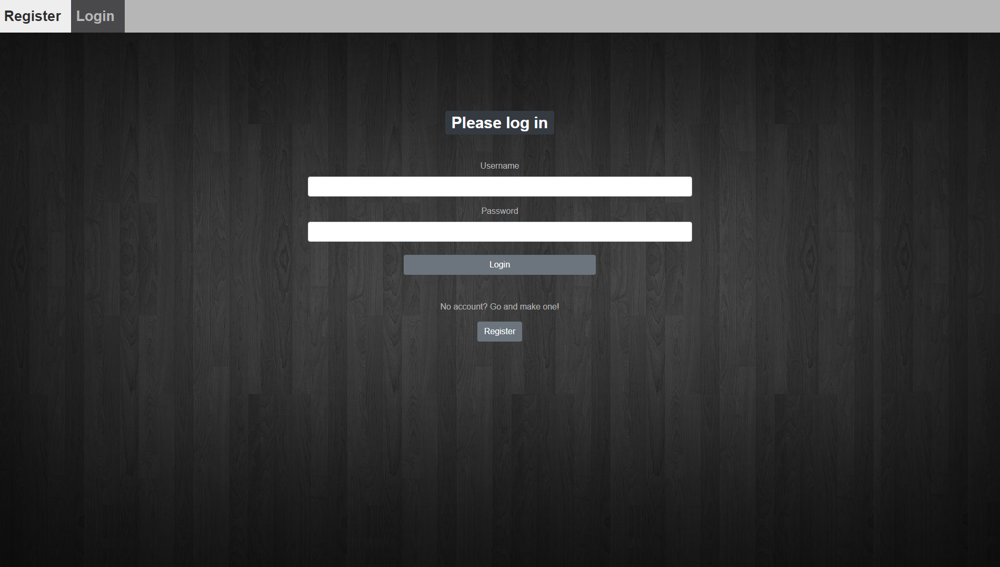
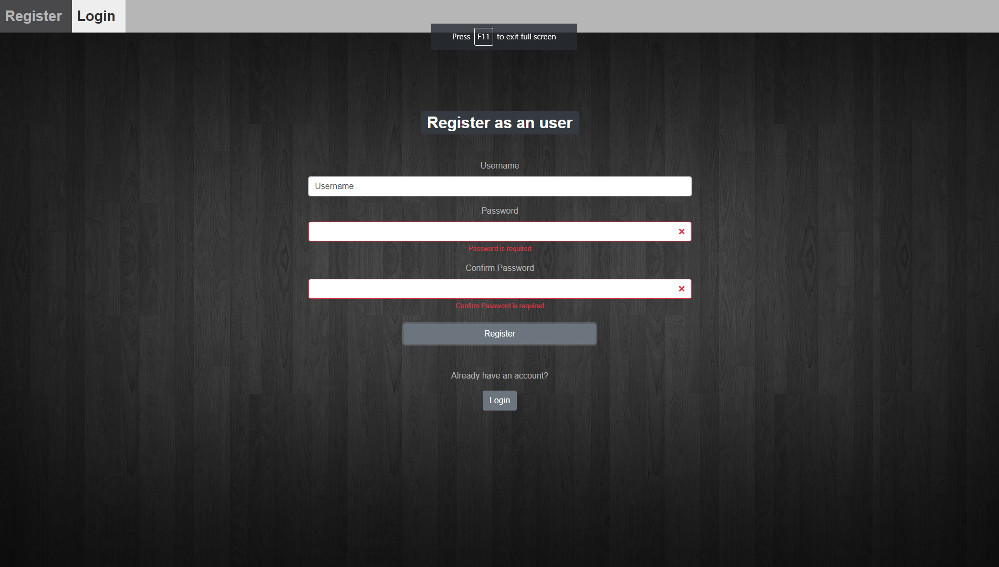
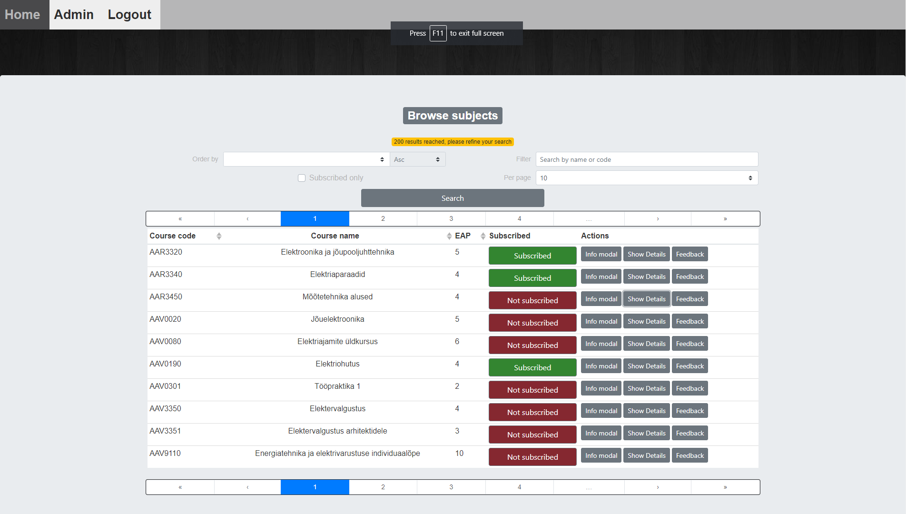
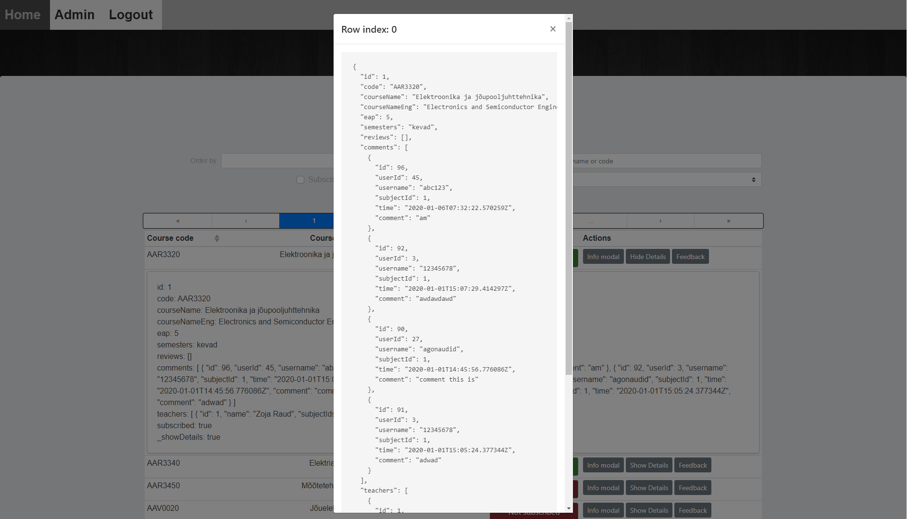
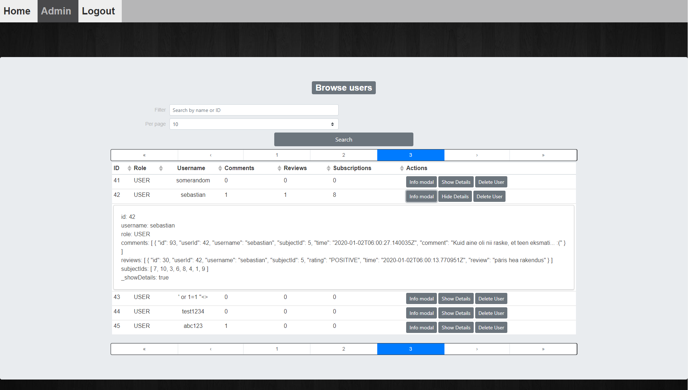
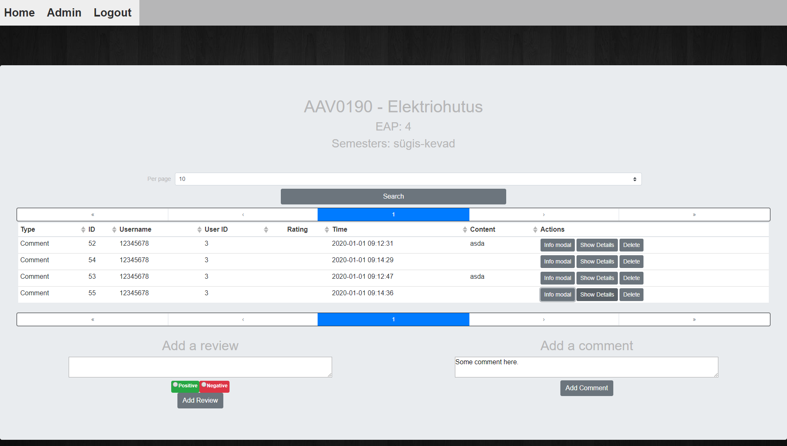
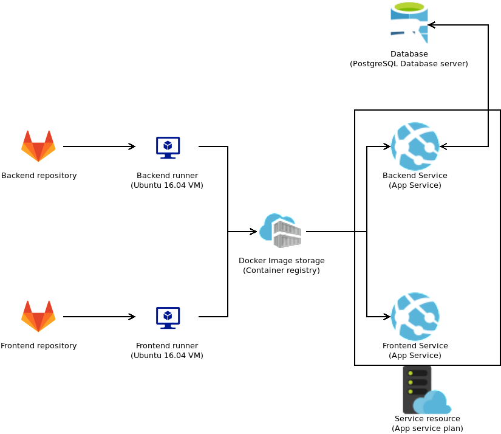

# Vue frontend

You can either log in with existing account



or register a new account



to view subjects



and their details



users, if admin and



and give feedback



to subjects given at TalTech.

Backend is accessible here: [github.com/envomp/TalTech-subjects-bac](https://github.com/envomp/TalTech-subjects-back)

## Quick install and setup
##### Debian
run in terminal:
```
./frontend_local_install.sh
```
This script has been tested on Ubuntu 18.04 and 19.04
##### Other operating systems
Install Debian based operating system and read the guide above.
 
or 

Read the `frontend_local_install.sh` file and acquire inspiration 
for necessary steps from there.

## Project setup
```
npm install
```

### Compiles and hot-reloads for development
```
npm run serve
```

### Compiles and minifies for production
```
npm run build
```

### Run your unit tests
```
npm run test:unit
```

### Run your end-to-end tests
```
npm run test:e2e
```

### CI/CD structure


[Full repo](https://gitlab.cs.ttu.ee/envomp/iti0203-2019-project)

## Azure set up

### Frontend
- Uses Azure web app service.
- Frontend is reachable on the url you provide during web app service initial set up. (https://iti0203-team04.azurewebsites.net/ for our project) 
#### Docker 
- Multicontainer mode using docker compose found in `frontend_azure_docker-compose.yml`.
- Docker image is downloaded from Azure image registry.
- Pipeline is set up to build a docker image and deploy it to image registry.
#### Networking
- Frontend is served using nginx.
- Nginx is added onto the docker image during building of docker image and is in the same image as frontend (no separate docker service for nginx).
- Nginx uses `nginx.conf` in project root for configuration.
- Nginx is configured to proxy requests to `/api` to backend URL.
- Nginx listens on port 8080 but it is forwarded using docker compose.
- Frontend is accessable on port 80 using both http and https protocols.
    - Docker compose sets the image to use different port but it is forwarded to use 80 by Azure.
- Custom domain is set up to link to frontend. (https://sometotallyrandomapplicationonarandomurl.com/)
#### Logs
- Logs are accessable on https://iti0203-team04.scm.azurewebsites.net/api/vfs/LogFiles/ or replace iti0203-team04 with the name of your web app service.
- New logfiles for each day
- Four log files
    - 2019_11_14_..._docker.log logs the docker container start and stop processes and image downloading
    - 2019_11_14_..._easyauth_docker.log logs requests to the frontend
    - 2019_11_14_..._default_docker.log no longer used
    - 2019_11_14_..._front_docker.log logs requests to the front end along with user IP and user-agent
- Additionally on Azure you can look at Log stream which is realtime logging of the web app service.
